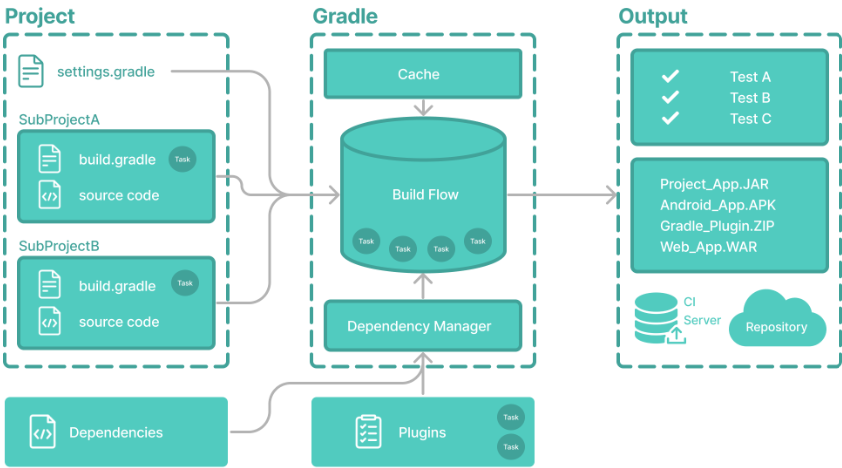

# Gradle

## What is Gradle?

It's an abbreviation of Gradle Build Tool, a build tool written by Java and Groovy (mostly).

## Why Gradle?

- Open source (Apache License 2.0)
- Support building Java (+ Android), JavaScript, and C/C++ projects
- Supported by Android Studio, IntelliJ IDEA, Visual Studio Code IDEs.

## Overview

- Project: a main project which may include subprojects. Each project has one `settings.gradle`, and each subproject contains a `build.gradle` and a `src` directory containing source code.
- (Gradle) Task: a particular job we want Gradle to do, such as build, test, or run a project, a subproject, or a file. A task can use other tasks to handle a particular purpose.
- Dependencies: external packed source code included in the project (or a particular subproject)
- Plugins: a way to add customized Gradle tasks into Gradle

## Gradle project structure

- [project]
  - gradle.settings
  - [subprojectA]
    - build.gradle
    - [src]
  - [subprojectB]
    - build.gradle
    - [src]

## Next

- [Installing Gradle](install/README.md)
- [`gradle` command](gradle-command.md)
- [`settings.gradle` file](settings-gradle.md)
- [`build.gradle` file](build-gradle.md)